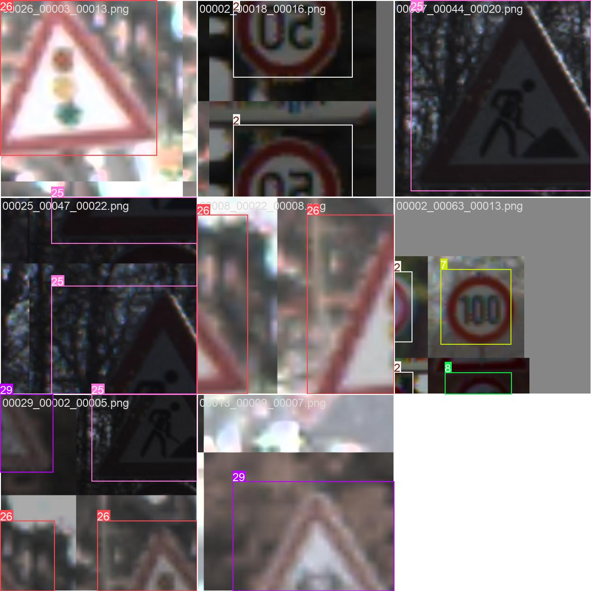

# Traffic Sign Detector

A computer-vision project for detecting and classifying traffic signs (bounding boxes + class labels). The repository includes dataset preparation, training and evaluation scripts and (possibly) a small demo for running inference on uploaded images.

## Dataset

This project uses the **GTSRB (German Traffic Sign Recognition Benchmark)** for training.
Official dataset page: [https://benchmark.ini.rub.de/gtsrb\_dataset.html](https://benchmark.ini.rub.de/gtsrb_dataset.html)

## Current training pictures

### Epoche 2



### Training Results
| epoch | time  | train/box_loss | train/cls_loss | train/dfl_loss | metrics/precision(B) | metrics/recall(B) | metrics/mAP50(B) | metrics/mAP50-95(B) | val/box_loss | val/cls_loss | val/dfl_loss | lr/pg0    | lr/pg1    | lr/pg2    |
|-------|-------|----------------|----------------|----------------|----------------------|-------------------|-------------------|---------------------|--------------|--------------|--------------|------------|------------|------------|
| 1     | 604.51| 0.76113        | 1.70503        | 1.18801        | 0.83116             | 0.87122          | 0.88858          | 0.78569            | 0.53429      | 0.50377      | 0.98442     | 0.00333248 | 0.00333248 | 0.00333248 |
| 2     | 1165.39| 0.62799       | 0.94776        | 1.04853        | 0.8692              | 0.95057          | 0.93239          | 0.8352             | 0.49654      | 0.34681      | 0.9369      | 0.00653383 | 0.00653383 | 0.00653383 |
| 3     | 1723.27| 0.63762       | 0.93802        | 1.04091        | 0.95064             | 0.87951          | 0.92394          | 0.82838            | 0.48219      | 0.34295      | 0.92401     | 0.00960318 | 0.00960318 | 0.00960318 |
| 4     | 2271.1 | 0.60868        | 0.88347        | 1.01995        | 0.8878              | 0.97246          | 0.93975          | 0.86399            | 0.4364       | 0.28365      | 0.88963     | 0.009406   | 0.009406   | 0.009406   |
| 5     | 2810.39| 0.55173        | 0.79111        | 0.99546        | 0.90989             | 0.97435          | 0.93312          | 0.87256            | 0.38516      | 0.24488      | 0.8613      | 0.009208   | 0.009208   | 0.009208   |
| 6     | 3348.85| 0.51572        | 0.73677        | 0.98076        | 0.90982             | 0.9653           | 0.93968          | 0.89345            | 0.34955      | 0.22857      | 0.84319     | 0.00901    | 0.00901    | 0.00901    |
| 7     | 4007.29| 0.49096        | 0.69229        | 0.97135        | 0.92937             | 0.97216          | 0.95875          | 0.91853            | 0.32491      | 0.20884      | 0.83627     | 0.008812   | 0.008812   | 0.008812   |
| 8     | 4614.46| 0.47109        | 0.66669        | 0.9659         | 0.94357             | 0.98032          | 0.97031          | 0.93168            | 0.32484      | 0.18687      | 0.83042     | 0.008614   | 0.008614   | 0.008614   |


## How to prepare the dataset

> Note: The repository already contains a script `src/prepare_dataset.py` that reads CSV annotation files and copies images into a structured folder hierarchy under `data/processed/gtsrb/{train,val,test}/{class_id}/...`.

### Steps to run the existing preparation script

1. Place the raw dataset under `data/raw/gtsrb/` (for example, as downloaded from the official benchmark).
2. Make sure `Train.csv` and `Test.csv` are available in `data/raw/gtsrb/`.
3. Run the script:

   ```bash
   python src/prepare_dataset.py
   ```
4. Example console output produced by the script (local run):

   ```text
   Verarbeite Trainingsdaten...
   Trainingsdaten verarbeitet: 31367 Bilder in 'train', 7842 in 'val'
   Verarbeite Testdaten...
   Testdaten verarbeitet: 12630 Bilder in 'test'

   Datenverarbeitung abgeschlossen
   ```
5. Result: `data/processed/gtsrb/train|val|test/<class_id>/...` with the copied images. The script checks whether destination files already exist and will not copy files twice.
