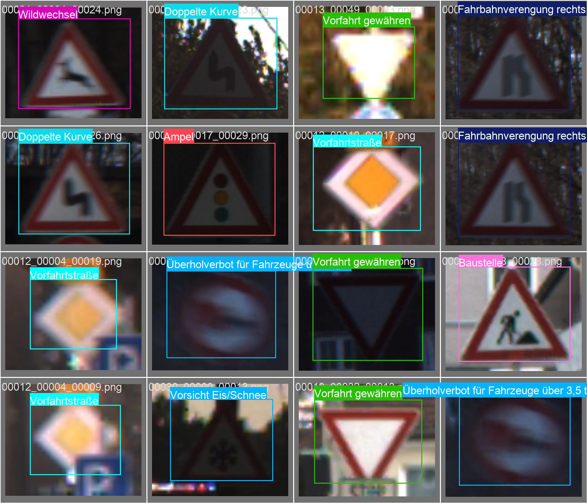
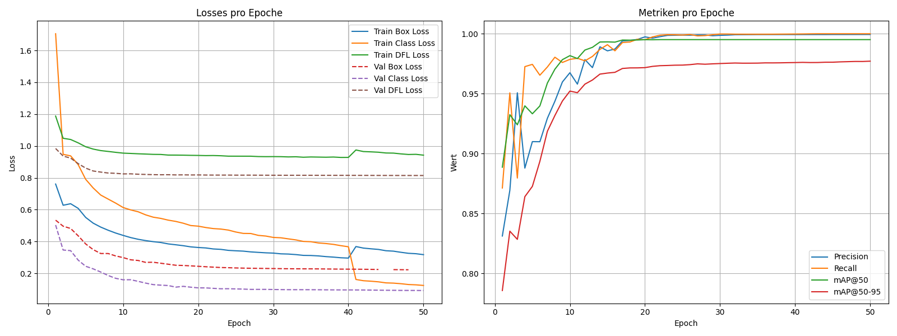

# Traffic Sign Detector

A computer-vision project for detecting and classifying traffic signs (bounding boxes + class labels). The repository includes training and evaluation scripts and (possibly) a small demo for running inference on uploaded images.

## Dataset

This project uses the **GTSRB (German Traffic Sign Recognition Benchmark)** for training.
Official dataset page: [https://benchmark.ini.rub.de/gtsrb\_dataset.html](https://benchmark.ini.rub.de/gtsrb_dataset.html)

## Current training pictures

### Final Training results

### Training Results

