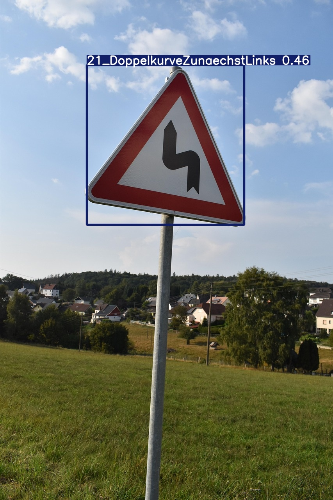
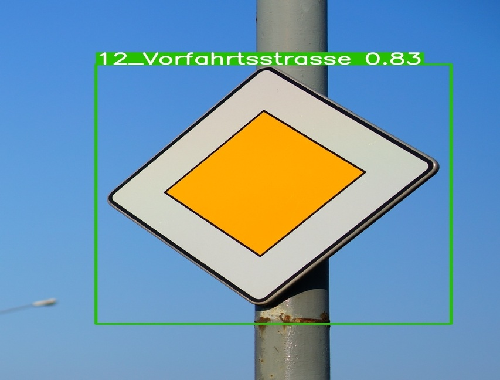
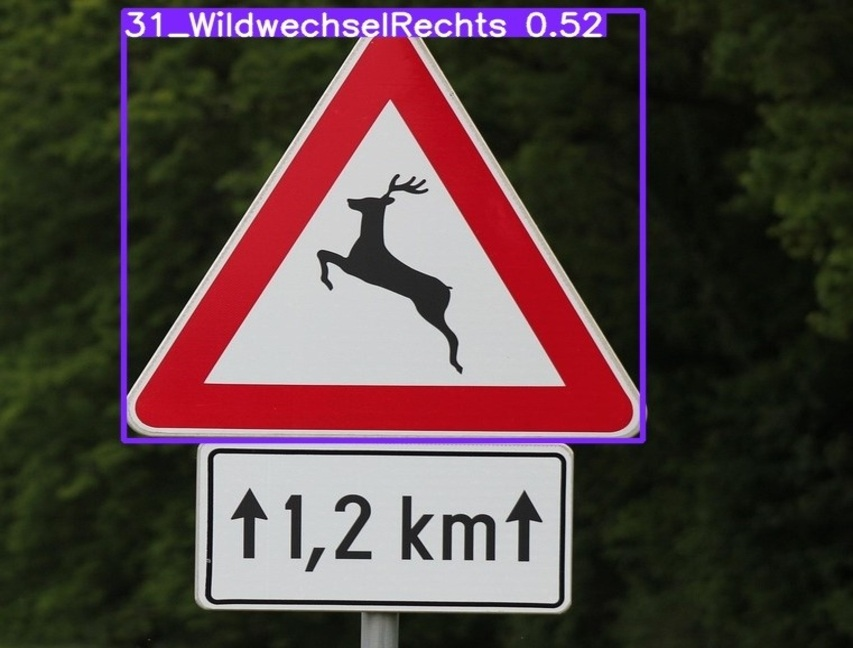
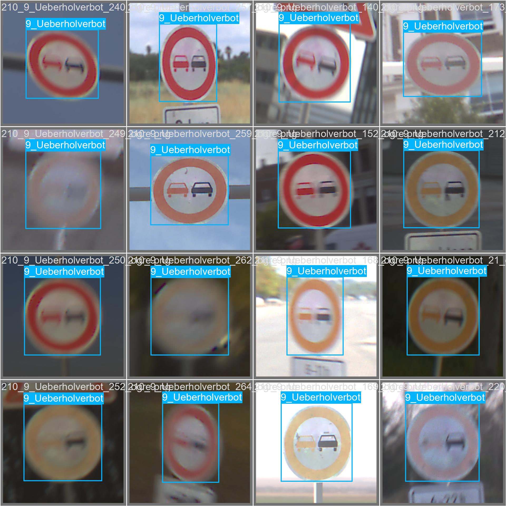
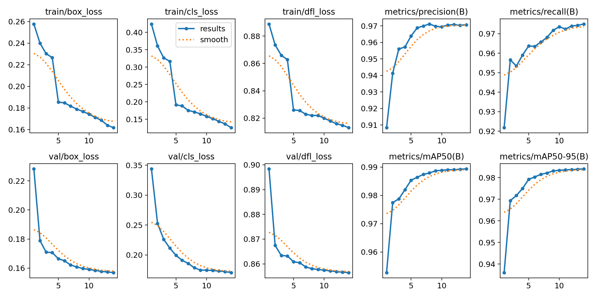
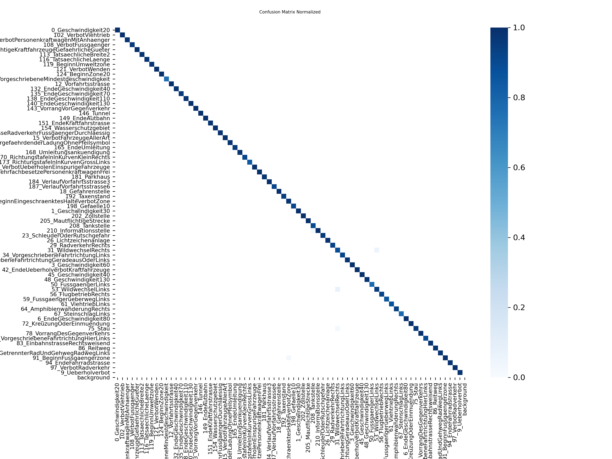
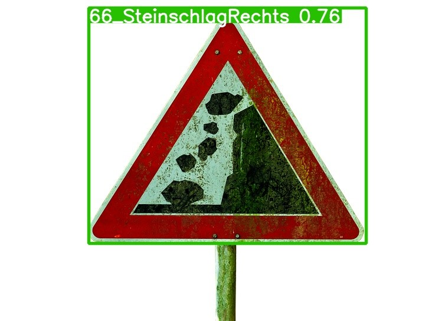
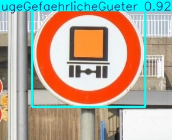

<div align="center">
  <h1>YOLOv8 Traffic Sign Detector</h1>
  <p><strong>Focused computer-vision workflow for German road-sign detection, from raw dataset conversion to YOLOv8 training and inference.</strong></p>
  <p>
    <a href="https://www.python.org/" target="_blank" rel="noreferrer">
      
    </a>
    <a href="https://docs.ultralytics.com/" target="_blank" rel="noreferrer">
      
    </a>
    <a href="https://owncloud.fraunhofer.de/index.php/s/OLQ6E5BVN4pRGu8?path=%2FSynsetSignsetGermany" target="_blank" rel="noreferrer">
      
    </a>
    <a href="https://www.kaggle.com/learn/computer-vision" target="_blank" rel="noreferrer">
      
    </a>
  </p>
  <p>
    <a href="#key-features">Key Features</a> •
    <a href="#2-overview">Overview</a> •
    <a href="#3-training">Training</a> •
    <a href="#4-dataset">Dataset</a> •
    <a href="#5-setup">Setup</a> •
    <a href="#6-inference-example">Inference</a>
  </p>
</div>

This repository is built around a narrow goal: detect and classify German traffic signs with a dedicated pipeline instead of relying on broad or mixed-country detection projects. It includes the missing glue work too, especially dataset conversion and preparation, so the raw SynsetSignsetGermany source can be turned into a usable YOLOv8 training set.

<!-- Preview: small thumbnails (centered, clean, no borders) -->
<div align="center" style="margin: 16px 0;">
  <a href="images/predict/steileKurve.jpg">
    
  </a>
  <a href="images/predict/vorfahrt_blauerHimmel.jpg">
    
  </a>
  <a href="images/predict/wild.jpg">
    
  </a>
</div>

---
## Key Features

- Focused on German road signs instead of a broad mixed-country detector.
- Converts and prepares SynsetSignsetGermany for a YOLOv8 workflow.
- Includes validation scripts, training entrypoints, and inference helpers.
- Keeps example predictions and training outputs directly in the repository.

---

## 2. Overview

1. Convert SynsetSignsetGermany → YOLO format (images + `.txt` labels with normalized bboxes).
2. Produce `data/yolo_signs` containing:
   - `train/images`, `train/labels`
   - `val/images`,   `val/labels`
   - `classes.txt` (one class name per line)
   - `data.yaml` (YOLO/Ultralytics dataset file with relative paths)
3. Validate dataset integrity with `scripts/validate_yolo_dataset.py`.
4. Train YOLOv8 using `scripts/train_model/start_train.py` with W&B logging and TensorBoard.

---

## 3. Training

### 3.1 Training Pictures and Data





### 3.2 Train (YOLOv8m) Example

Start training locally (example):
```bash
python scripts/train_model/start_train.py
# or with ultralytics directly:
# python -c "from ultralytics import YOLO; YOLO('yolov8m.pt').train(data='data/yolo_signs/data.yaml', epochs=50, imgsz=640, batch=16, name='yolov8m_run')"
```
Notes:
- Adjust `batch` / `imgsz` to your GPU memory.  
- The trainer supports W&B and prints a TensorBoard command if logs are enabled.  
- Ultralytics downloads the base `yolov8m.pt` weights if they are not already present locally.

---

## 4. Dataset
 **Current dataset:** 
`SynsetSignsetGermany` (replaces GTSRB for this project).

Download location (example / internal):  
https://owncloud.fraunhofer.de/index.php/s/OLQ6E5BVN4pRGu8?path=%2FSynsetSignsetGermany

Place the extracted SynsetSignsetGermany archive under `data/raw/` so the converter scripts can find the expected folders.

Typical extracted structure (important folders):

```
data/raw/SynsetSignsetGermany/
  Ogre/               # images organized in class subfolders (0..210)
  Masks/              # masks per-class (0..210) used to compute bboxes
  Labels/             # optional semantic labels per-class (0..210)
  CsvFiles/           # various csv splits and metadata (optional)
  Cycles/             # JSON metadata per-image (optional)
```

Notes:
- Each Ogre class folder contains the original image files + .json with metadata (e.g. `0_ogre.png`, `0_ogre.json`, `1_ogre.png`,`1_ogre.json` …).
- Masks and Labels folders are used to extract bounding boxes (masks -> contours -> bbox).
- Many helper scripts expect these folders to exist under `data/raw/SynsetSignsetGermany`.

### 4.1 Convert and Prepare Dataset

From project root, example conversion command:
```
python scripts/convert_synset_to_yolo.py `
   --raw data/raw/SynsetSignsetGermany `
   --masks data/raw/SynsetSignsetGermany/Masks `
   --semantic data/raw/SynsetSignsetGermany/Labels `
   --out data/yolo_signs `
   --split 0.8 0.2 0.0
```
This will compute bboxes from masks and write images + `.txt` labels into `data/yolo_signs/train|val`.

### 4.2 Validate Dataset

Quick check:
```bash
python scripts/validate_yolo_dataset.py
```
What it prints:
- counts for `train` and `val` images/labels,  
- up to N sample images missing labels, or labels missing images,  
- basic YOLO label format issues.

### 4.3 Generate `data.yaml` (relative paths)

Run:
```
python scripts/create_data_yaml.py 
```
`data/yolo_signs/data.yaml` will use relative paths (so the trainer resolves `train: train/images`, `val: val/images` when `path: .`).

Example `data.yaml` contents:

path: data/yolo_signs
train: train/images
val:   val/images
nc:    211
names:
  0: "0_Geschwindigkeit20"
  1: "100_VerbotReiter"
  ...

Important: Ultralytics accepts either `names` list or mapping; `classes.txt` can be used by many visualization tools to map id->name.

---

## 5. Setup

### 5.1 Clone the repository
```bash
git clone https://github.com/jantrw/traffic-sign-detector.git
cd traffic-sign-detector
```

### 5.2 Create and activate a virtual environment (recommended)
**Linux / macOS**
```bash
python3 -m venv yolov8traffictracking
source yolov8traffictracking/bin/activate
```

**Windows (PowerShell)**
```powershell
python -m venv yolov8traffictracking
.\yolov8traffictracking\Scripts\Activate.ps1
# (or for cmd): yolov8traffictracking\Scripts\activate.bat
```

### 5.3 Install dependencies
```bash
pip install --upgrade pip
pip install -r requirements.txt
```

Cloning this repo is not enough to run inference end-to-end. You must supply your own trained `.pt` model file.

### 5.4 Model files
This repo does not include trained `.pt` weights.

- `yolov8m.pt` is not stored in this repository.
- `training_results/.../best.pt` is not stored in this repository.
- Training starts from the Ultralytics `yolov8m.pt` checkpoint name, which Ultralytics downloads if needed.
- Inference requires your own local model path.

### 5.5 Python wrapper scripts
The repo includes `run_detect.py` for local inference once you have a model file.

**Example: single-image**
```bash
python run_detect.py images/steileKurve.jpg --model path/to/best.pt
```
**Example: with your own Image**
```bash
python run_detect.py C:/Users/deinUserName/Downloads/image.png --model path/to/best.pt
```
**Example: multi-image detection**
```bash
python run_detect.py images/ --model path/to/best.pt
```
### 5.6 Troubleshooting quick guide
- **No detections:** try `--conf 0.01` or `conf=0.05` and `imgsz=1024`.  
- **Detections but many false positives:** raise `conf` to `0.3–0.5`, use temporal smoothing in video (require detection in 2 consecutive frames).  
- **Model checkpoint missing or wrong:** pass a valid local `.pt` path via `--model`. Use `yolo val model=... data=data/yolo_signs/data.yaml` to verify it.

### 5.7 Detected Images

<div style="display:flex; flex-wrap:wrap; gap:8px; align-items:flex-start;">
  
  
  
  
  
</div>

---

## 6. Inference Example

Below is a minimal snippet that runs inference and draws bounding boxes labeled by class names (labels come from `classes.txt`):

```python
from ultralytics import YOLO
import cv2, json, pathlib

model = YOLO("runs/train/your_run/weights/best.pt")
res = model("some_test_image.jpg")                   # returns results

# load class names
names = [l.strip() for l in open("data/yolo_signs/classes.txt", encoding="utf8").read().splitlines()]

# draw (first result)
boxes = res[0].boxes  # ultralytics result
img = cv2.imread("some_test_image.jpg")
for box in boxes:
    x1,y1,x2,y2 = map(int, box.xyxy[0].tolist())
    cls = int(box.cls[0].item())
    label = names[cls] if cls < len(names) else str(cls)
    cv2.rectangle(img, (x1,y1), (x2,y2), (0,255,0), 2)
    cv2.putText(img, label, (x1, max(0,y1-6)), cv2.FONT_HERSHEY_SIMPLEX, 0.45, (255,255,255), 1)
cv2.imwrite("inference_with_labels.jpg", img)
```

This draws borders with the **folder/class names** (as requested) by mapping class IDs to names using `classes.txt`.

---
