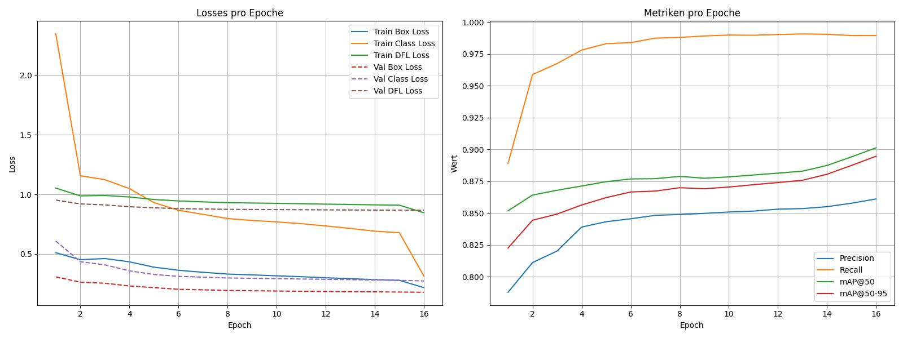

# Traffic Sign Detector

A computer-vision project for detecting and classifying traffic signs (bounding boxes + class labels). This repository provides conversion tools, validators and training scripts to convert the SynsetSignsetGermany raw data into a YOLOv8-compatible dataset, train a YOLOv8 model, and run inference.

---
## Current Training Pictures


### Training Batches with Border

### Training Data


## Dataset
 **Current dataset:** 
`SynsetSignsetGermany` (replaces GTSRB for this project).

Download location (example / internal):  
https://owncloud.fraunhofer.de/index.php/s/OLQ6E5BVN4pRGu8?path=%2FSynsetSignsetGermany

Place the extracted SynsetSignsetGermany archive under `data/raw/` so the converter scripts can find the expected folders.

Typical extracted structure (important folders):

```
data/raw/SynsetSignsetGermany/
  Ogre/               # images organized in class subfolders (0..210)
  Masks/              # masks per-class (0..210) used to compute bboxes
  Labels/             # optional semantic labels per-class (0..210)
  CsvFiles/           # various csv splits and metadata (optional)
  Cycles/             # JSON metadata per-image (optional)
```

Notes:
- Each Ogre class folder contains the original image files + .json with metadata (e.g. `0_ogre.png`, `0_ogre.json`, `1_ogre.png`,`1_ogre.json` …).
- Masks and Labels folders are used to extract bounding boxes (masks -> contours -> bbox).
- Many helper scripts expect these folders to exist under `data/raw/SynsetSignsetGermany`.

---

## What this repo does (summary)

1. Convert SynsetSignsetGermany → YOLO format (images + `.txt` labels with normalized bboxes).
2. Produce `data/yolo_signs` containing:
   - `train/images`, `train/labels`
   - `val/images`,   `val/labels`
   - `classes.txt` (one class name per line)
   - `data.yaml` (YOLO/Ultralytics dataset file with relative paths)
3. Validate dataset integrity with `scripts/validate_yolo_dataset.py`.
4. Train YOLOv8 (we use `yolov8m.pt` by default) using `scripts/train_model/start_train.py` with W&B logging and TensorBoard.

---

## Files & Scripts (where to find them)

Top-level `scripts/` (conversion & dataset tools):

- `convert_synset_to_yolo.py`  - Main converter. Reads `Ogre/`, `Masks/`, `Labels/`. Computes bboxes from masks and writes YOLO `.txt` labels. Produces `data/yolo_signs/*` (images & labels). Writes `data/yolo_signs/classes.txt`.

- `convert_traindata_to_image.py`  - Generates a training visualization image (e.g. `TrainingResults.jpg`) from intermediate `resultset.csv` or other metrics. **Note: Can be used during training, I'd suggest wait 2 or more Epoches for the best Image.** 

- `create_data_yaml.py`  - Build `data/yolo_signs/data.yaml` (relative paths and `names` entries). Use after conversion or when editing classes.

- `create_val_split.py`  - Carve out a random validation split (default 10%) by moving images + labels from `train/` to `val/`.

- `validate_yolo_dataset.py`  - Quick validator that checks image↔label correspondence and basic YOLO label format.

- `test_gpu_support.py`  - Small helper to check if PyTorch detects a CUDA GPU and prints device info.

Training utilities under `scripts/train_model/`:

- `start_train.py`  - Runs training using `ultralytics` YOLO API. Script is Windows-safe (uses `if __name__ == "__main__":` + `multiprocessing.freeze_support()` in the provided version). It initializes a W&B run (if configured) and prints TensorBoard instructions.

- `yolov8m.pt` / `yolo11n.pt`  - Local pretrained weights used by trainer and optional helper modules.

---

## Example: Convert & prepare dataset

From project root, example conversion command:
```
python scripts/convert_synset_to_yolo.py `
   --raw data/raw/SynsetSignsetGermany `
   --masks data/raw/SynsetSignsetGermany/Masks `
   --semantic data/raw/SynsetSignsetGermany/Labels `
   --out data/yolo_signs `
   --split 0.8 0.2 0.0
```
**Note: Paths in `scripts/convert_synset_to_yolo.py` + the conversion command maybe have to be adjusted.**

This will:
- index masks and labels,
- compute bounding boxes from masks,
- copy images into `data/yolo_signs/train|val/images` and write corresponding `.txt` label files,
- write `classes.txt`.

---

## Example: Generate data.yaml (relative paths)

Run:
```
python scripts/create_data_yaml.py 
```
`data/yolo_signs/data.yaml` will use relative paths (so the trainer resolves `train: train/images`, `val: val/images` when `path: .`).

Example `data.yaml` contents:

path: data/yolo_signs
train: train/images
val:   val/images
nc:    211
names:
  0: "0_Geschwindigkeit20"
  1: "100_VerbotReiter"
  ...

Important: Ultralytics accepts either `names` list or mapping; `classes.txt` can be used by many visualization tools to map id->name.

---

## Train (YOLOv8, example)

Start training (from project root):
```
python scripts/train_model/start_train.py
```
Key training notes:
- Uses `ultralytics` `YOLO("yolov8m.pt")` and `model.train(...)`.
- The script integrates with **Weights & Biases** (W&B). Login once with `wandb login` if you want online monitoring.
- Trainer prints a TensorBoard command like:
  TensorBoard: Start with 'tensorboard --logdir <run_dir>', view at http://localhost:6006/

- If you run on Windows and encounter the multiprocessing spawn error, either:
  - ensure `start_train.py` is the guarded main module (it is in the repo), or
  - use `workers=0` in `model.train(...)` (slower I/O, but avoids spawn issues).
- If you don't want tracker downloads (small helper weights like `yolo11n.pt`), the trainer script in repo sets `tracker=None` to avoid the extra download by default.

Example training parameters you can tweak in `start_train.py`:
```python
model.train(
  data="data/yolo_signs/data.yaml",
  epochs=50,
  imgsz=640,
  batch=16,               # adjust by GPU memory
  name="synset_signs_run",
  project="synset_signset_germany",
  tracker=None,           # avoid extra downloads
  # workers=0             # use if spawn issues occur
)
```

W&B run is available at `https://wandb.ai/<your-account>/<project>/runs/<run-id>` (the script prints the run URL at start).

---

## Inference example (draw boxes with class names)

Below is a minimal snippet that runs inference and draws bounding boxes labeled by class names (labels come from `classes.txt`):

```python
from ultralytics import YOLO
import cv2, json, pathlib

model = YOLO("runs/train/your_run/weights/best.pt")  # or yolov8m.pt (finetune)
res = model("some_test_image.jpg")                   # returns results

# load class names
names = [l.strip() for l in open("data/yolo_signs/classes.txt", encoding="utf8").read().splitlines()]

# draw (first result)
boxes = res[0].boxes  # ultralytics result
img = cv2.imread("some_test_image.jpg")
for box in boxes:
    x1,y1,x2,y2 = map(int, box.xyxy[0].tolist())
    cls = int(box.cls[0].item())
    label = names[cls] if cls < len(names) else str(cls)
    cv2.rectangle(img, (x1,y1), (x2,y2), (0,255,0), 2)
    cv2.putText(img, label, (x1, max(0,y1-6)), cv2.FONT_HERSHEY_SIMPLEX, 0.45, (255,255,255), 1)
cv2.imwrite("inference_with_labels.jpg", img)
```

This draws borders with the **folder/class names** (as requested) by mapping class IDs to names using `classes.txt`.

---

## Validate dataset (quick)

Run:
```
python scripts/validate_yolo_dataset.py
```
The script prints:
- image/label counts for `train` and `val`,
- up to 10 sample images without labels,
- up to 10 labels without images,
- basic format issues found in the first 200 labels.

---

## Troubleshooting & tips

- **`val/images` missing**: Check `data/yolo_signs/data.yaml` for relative paths and that `val/images` actually exists. If you have only `train/`, use `create_val_split.py` to carve out a validation set.
- **No `mappings/synset_to_classname.json`**: The converter writes mapping JSON only if it detected a folder->class mapping. If you absolutely need a JSON, generate it from `classes.txt` (simple script).
- **Slow conversion**: The mask-indexing step can be I/O heavy. If you see very long times while scanning many files, ensure masks are on a local disk (not slow network) and the script is using the optimized index variant (`--index` style`).
- **Windows multiprocessing errors**: Use `if __name__ == '__main__':` guard and `multiprocessing.freeze_support()` in start scripts (already included in `start_train.py`). If still failing, use `workers=0` in training.
- **Extra small model downloads (e.g., `yolo11n.pt`)**: Usually caused by tracker or helper modules. Keep `tracker=None` if you don't require tracking features.

---

## Example quick stats (observed during conversion)
- Classes detected: `211` (folder-based)
- Images scanned: ~`105,500` (this depends on which archives you extracted)
- Labels produced: depends on masks presence — expected ~`105k` label files if masks available

---
